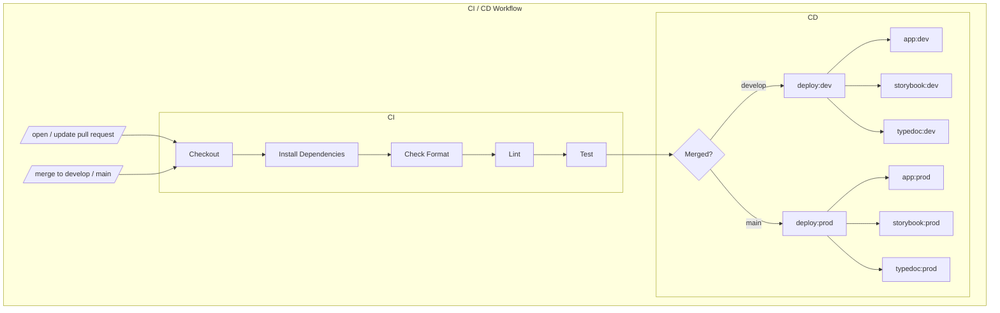

# 04 - CI / CD Strategy

### Status
`In Progress`
- Last updated `Aug 18th, 2022` by `Damiano Melcarne`.

### Context
A CI / CD workflow needs to be put in place to minimize upper environment bugs, maintain consistent code quality, and automate the testing / deployment process.

### Decisions
- `Github Actions` will be used to create the automated workflows triggered when pull requests are opened / updated and code is merged to the `main` / `develop` branches.
- A test coverage report should be generated after the completion of the testing phase.
- `Netlify` will be used for hosting. `Github Pages` could be used for `Typedoc` documention. Three sites will be deployed - the DEX application, the DEX UI component Storybook, and documentation for the UI and hooks library. 
- This workflow will need to be re-worked once the UI components and hooks are migrated to a seperate repo (`hedera-accelerator-defi-dex-ui-components`).
- Below is an outline of the general steps we've deemed necessary for an intial DEX UI / CD pipeline. 

