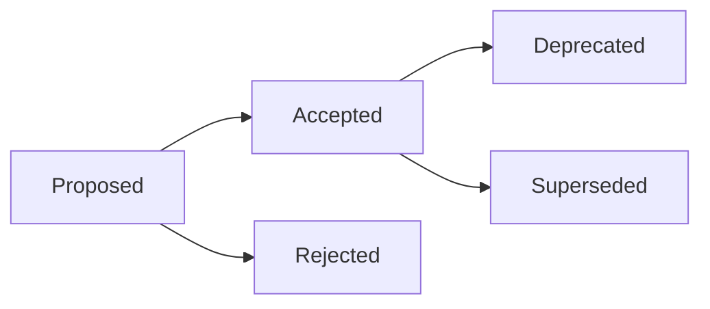

# Architecture Decision Record Template

### Status

What is the status of this decision?

**Proposed** - The decision needs to be reviewed by the Engineering team before implementation can begin.

**Accepted** - The Engineering team has reviewed the proposal, submitted feedback, and has signed off on moving forward with the proposed decision. Implementation can begin once a decision is accepted.

**Rejected** - The Engineering team found that the proposed decision does not solve the issue at hand, introduces too many drawbacks, or can be resolved with an alternative solution.

**Deprecated** - The document no longer reflects the state of the application architecture. The document should remain for historical context.

**Superseded** - The decision has been replaced. The document should remain as context that supports the superseding decision.

### Context

Details that will assist the reader in understanding why this decision has been proposed or implemented.

### Issue(s)

What issues motivated this proposal?

### Solution(s)

What options were considered when drafting a solution? Which solution was selected and what changes need to be made to the system?

### Implications

What are the side effects resulting from this decision? i.e., what are the key impacts on complexity, maintainability, testability, dependencies, uncertainty, risk, other decisions, etc.

### Resources

Information and related decision documents that provide additional context.
